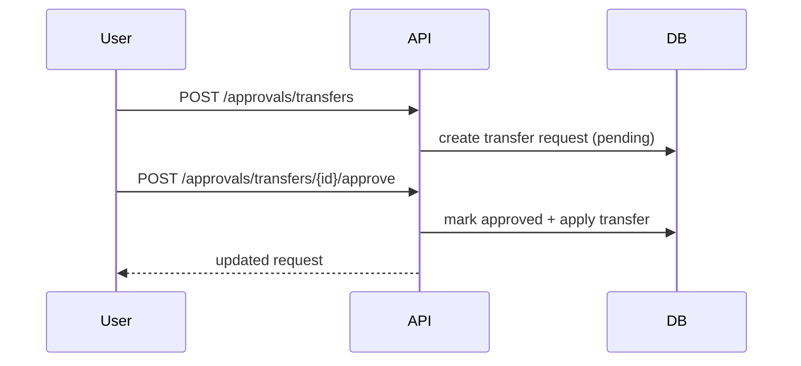
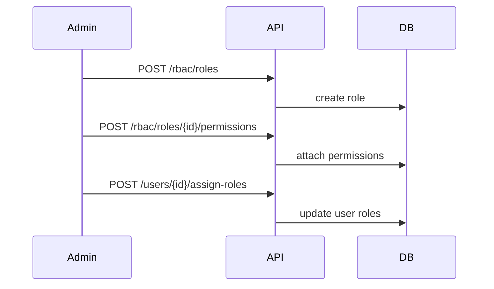
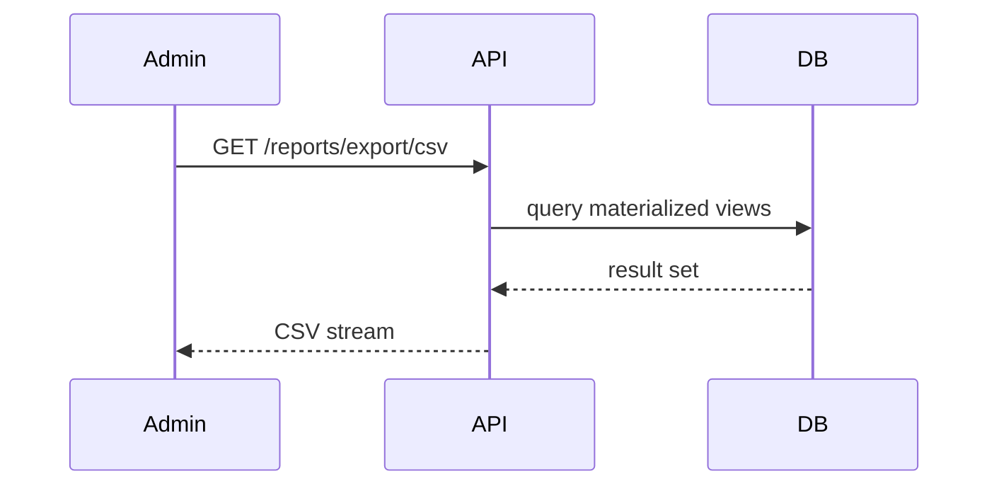

# Advanced Data Flows

## Approvals Flow

```mermaid
sequenceDiagram
  participant User
  participant API
  participant DB
  User->>API: POST /approvals/transfers
  API->>DB: create transfer request (pending)
  User->>API: POST /approvals/transfers/{id}/approve
  API->>DB: mark approved + apply transfer
  API-->>User: updated request
```

## RBAC Flow

```mermaid
sequenceDiagram
  participant Admin
  participant API
  participant DB
  Admin->>API: POST /rbac/roles
  API->>DB: create role
  Admin->>API: POST /rbac/roles/{id}/permissions
  API->>DB: attach permissions
  Admin->>API: POST /users/{id}/assign-roles
  API->>DB: update user roles
```

## Report Export Flow

```mermaid
sequenceDiagram
  participant Admin
  participant API
  participant DB
  Admin->>API: GET /reports/export/csv
  API->>DB: query materialized views
  DB-->>API: result set
  API-->>Admin: CSV stream
```
