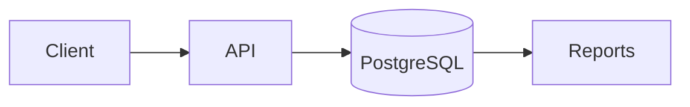
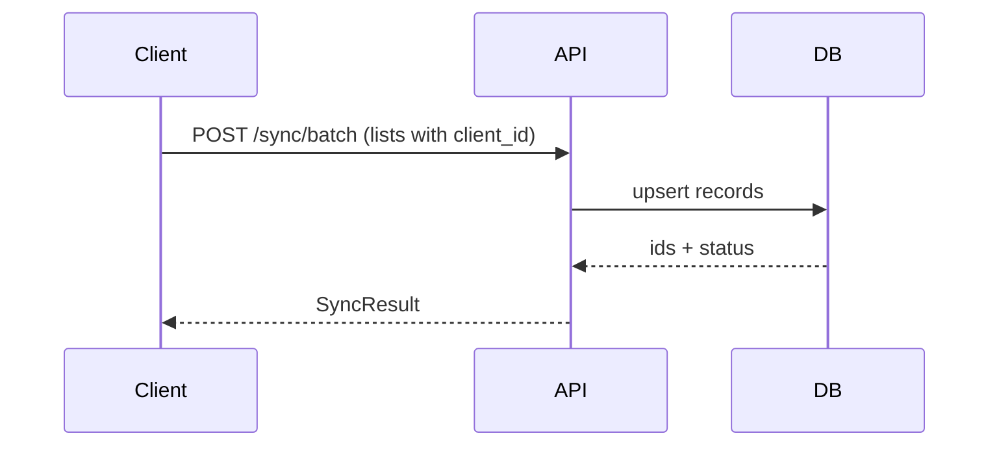
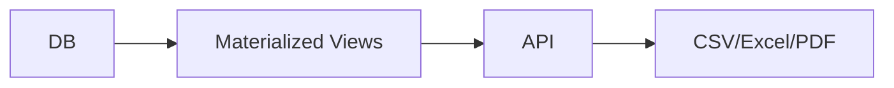

# Data Flow Diagrams

## Attendance / Offerings / Counts

```mermaid
graph LR
  Client --> API
  API --> DB[(PostgreSQL)]
  DB --> Reports
```

## Offline Sync

```mermaid
sequenceDiagram
  participant Client
  participant API
  participant DB
  Client->>API: POST /sync/batch (lists with client_id)
  API->>DB: upsert records
  DB-->>API: ids + status
  API-->>Client: SyncResult
```

## Reports

```mermaid
graph LR
  DB --> MV[Materialized Views]
  MV --> API
  API --> Export[CSV/Excel/PDF]
```
