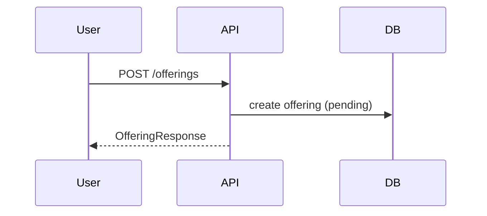
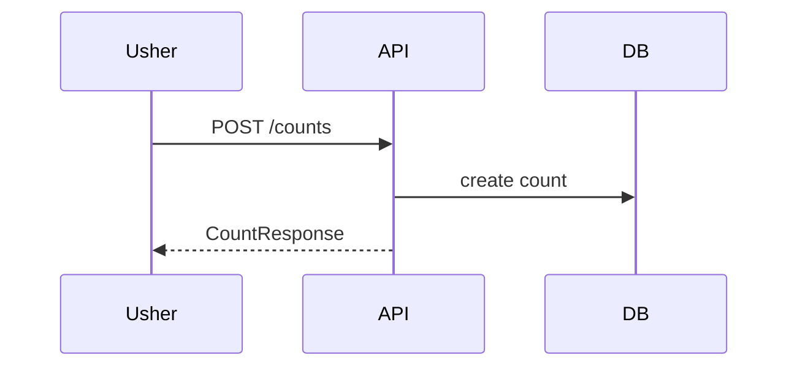
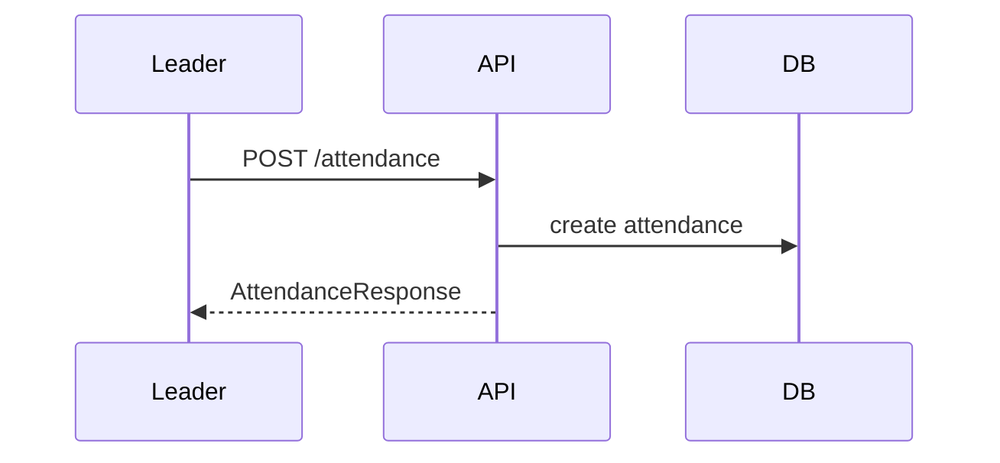
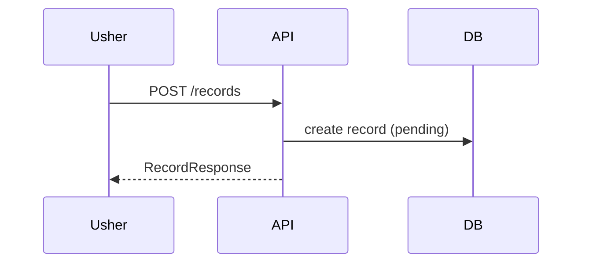
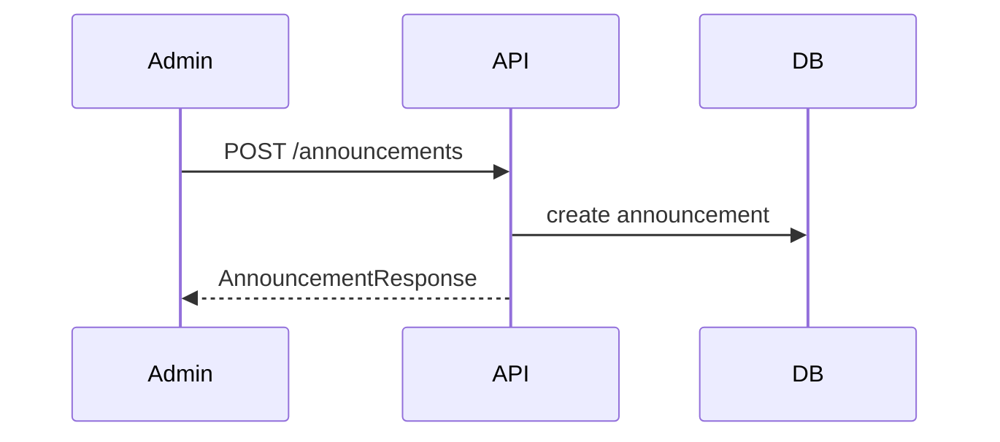
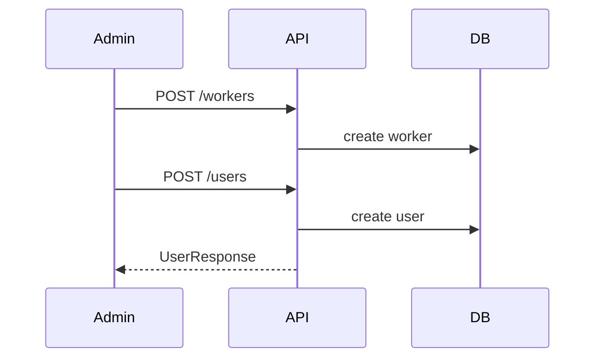
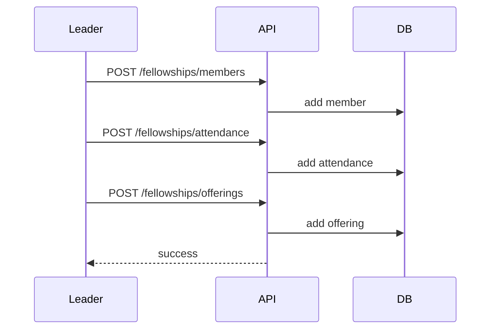

# Extra Diagrams

## Offerings Lifecycle

## Counts Lifecycle

## Attendance Lifecycle

## Newcomer/Convert Flow

## Announcement Publishing

## User Creation Flow

## Fellowship Activity Flow

