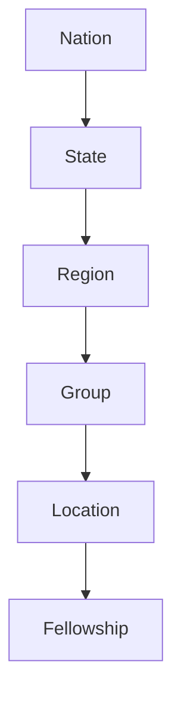

# Hierarchy Diagram

## Notes
- Each level inherits the parent path (ltree).
- Access is scoped by the user path.

## Sample Path (Kwara State Branch)
Display ID: `DCM-234-KW-ILN-ILE-001`  
Meaning: General church brand ID → Nigeria → Kwara State → Ilorin Region → Ilorin East Group → Living Spring Church (Lajolo Polygate area).
