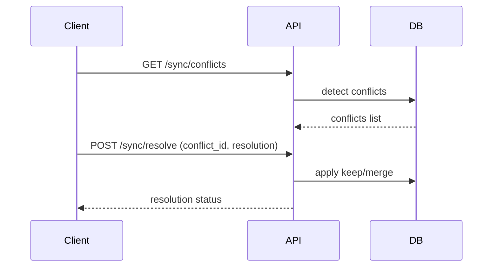
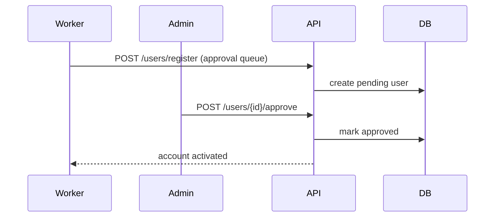
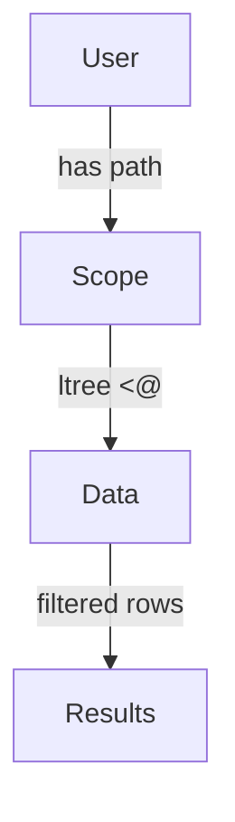
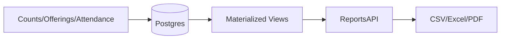
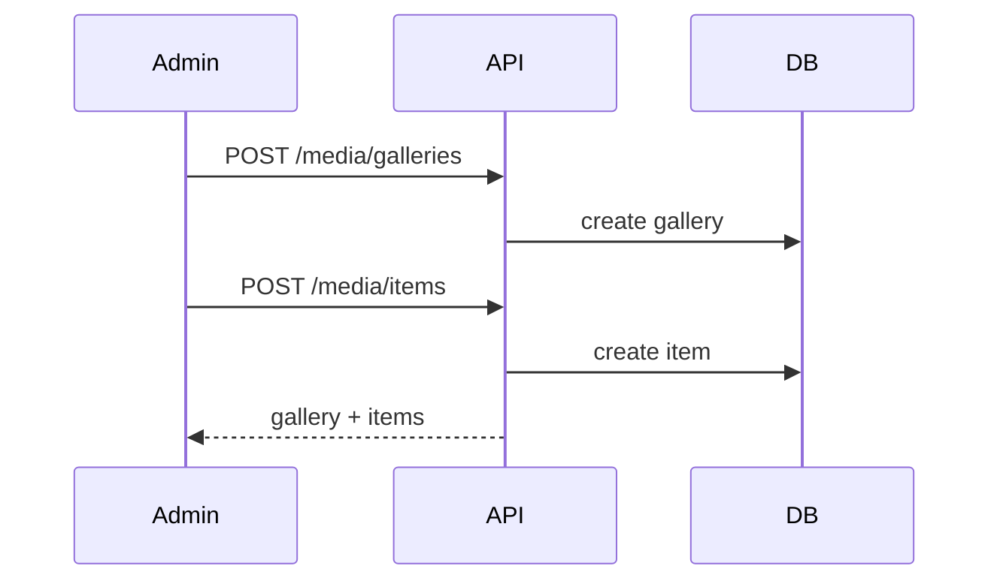
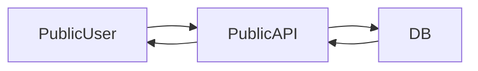

# Additional Diagrams

## Sync Conflict Resolution

```mermaid
sequenceDiagram
  participant Client
  participant API
  participant DB
  Client->>API: GET /sync/conflicts
  API->>DB: detect conflicts
  DB-->>API: conflicts list
  Client->>API: POST /sync/resolve (conflict_id, resolution)
  API->>DB: apply keep/merge
  API-->>Client: resolution status
```

## User Approval Workflow

```mermaid
sequenceDiagram
  participant Worker
  participant Admin
  participant API
  participant DB
  Worker->>API: POST /users/register (approval queue)
  API->>DB: create pending user
  Admin->>API: POST /users/{id}/approve
  API->>DB: mark approved
  API-->>Worker: account activated
```

## Data Scope Enforcement

```mermaid
graph TD
  User -->|has path| Scope
  Scope -->|ltree <@| Data
  Data -->|filtered rows| Results
```

## Reporting Pipeline

```mermaid
graph LR
  Ingest[Counts/Offerings/Attendance] --> DB[(Postgres)]
  DB --> MV[Materialized Views]
  MV --> ReportsAPI
  ReportsAPI --> Exports[CSV/Excel/PDF]
```

## Media Flow

```mermaid
sequenceDiagram
  participant Admin
  participant API
  participant DB
  Admin->>API: POST /media/galleries
  API->>DB: create gallery
  Admin->>API: POST /media/items
  API->>DB: create item
  API-->>Admin: gallery + items
```

## Public API Flow

```mermaid
graph LR
  PublicUser --> PublicAPI
  PublicAPI --> DB
  DB --> PublicAPI
  PublicAPI --> PublicUser
```
